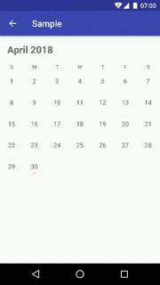

# CalendarViewPager
[ ](https://bintray.com/kuluna/maven/calendarviewpager/_latestVersion)

Simple and free customize calendar view.



- Horizontal paging calendars
- Customizable day cell
- Click and change pager listeners

# Setup
Require Android 5.0+

Add build.gradle

```
implementation 'jp.kuluna:calendarviewpager:2.0.0'
```

# Simple Usage
layout

```xml
<jp.kuluna.calendarviewpager.CalendarViewPager
  android:id="@+id/calendar_view_pager"
  android:layout_width="match_parent"
  android:layout_height="match_parent" />
```

MainActivity.kt
```kotlin
val viewPager = findViewById<CalendarViewPager>(R.id.calendar_view_pager)
viewPager.adapter = CalendarPagerAdapter(this)
```

# Customize

Override CalendarPagerAdapter

```kotlin
class CustomCalendarAdapter(context: Context) : CalendarPagerAdapter(context) {
    override fun onCreateView(parent: ViewGroup, viewType: Int): View {
        return LayoutInflater.from(context).inflate(R.layout.view_calendar_cell, parent, false)
    }

    override fun onBindView(view: View, day: Day) {
        if (day.state == DayState.ThisMonth) {
            view.visibility = View.VISIBLE
            view.findViewById<TextView>(R.id.text_day).text = day.calendar.get(Calendar.DAY_OF_MONTH).toString()
            view.findViewById<View>(R.id.view_dot).visibility = if (day.isSelected) View.VISIBLE else View.GONE
        } else {
            view.visibility = View.INVISIBLE
        }
    }
}
```

```kotlin
// setup adapter
val viewPager = findViewById<CalendarViewPager>(R.id.calendar_view_pager)
viewPager.adapter = CustomCalendarAdapter(this)

// listeners
viewPager.onDayClickListener = { day: Day ->
  Toast.makeText(this, day.calendar.time.toString(), Toast.LENGTH_SHORT).show()
}

viewPager.onDayLongClickListener = { day: Day ->
    Toast.makeText(this, "Long Clicked :" + day.calendar.time.toString(), Toast.LENGTH_SHORT).show()
    true
}

viewPager.onCalendarChangeListener = { calendar: Calendar ->
    Toast.makeText(this, calendar.time.toString(), Toast.LENGTH_SHORT).show()
}
```

# Contributing
1. Fork it!
1. Create your feature branch: git checkout -b my-new-feature
1. Commit your changes: git commit -am 'Add some feature'
1. Push to the branch: git push origin my-new-feature
1. Submit a pull request :D

# License
MIT License.
